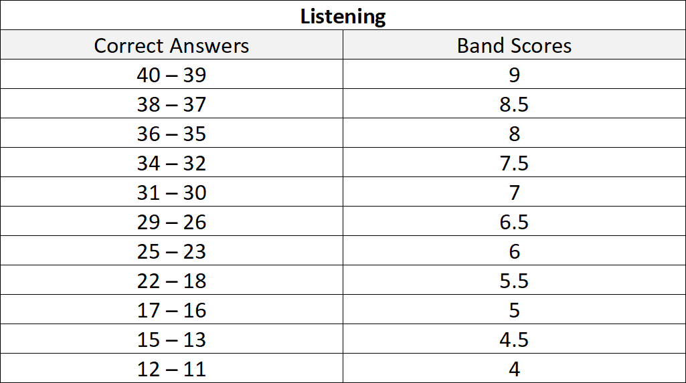

# IELTS-Practice
This repository is for tracking my answers and band scores every time I give a test. I am using ChatGPT to have my writing tasks checked and scored on it. As for the rest, I am checking the answers provided for each book.  
I am using the following marks table to score my reading and listening segments.  

**Scores Achieved:**  

  
Book 16

  
  | Band Score | Test 1 |
  |----------:|----------------|
  | 5.5 - 6.0 | Writing - 1 |
  | 5.5 - 6.0 | Writing - 2 |
  | 7.0       | Reading        |
  | 8.0       | Listening      |

  
  | Band Score | Test 2 |
  |----------:|----------------|
  |  | Writing - 1 |
  |  | Writing - 2 |
  |    6.0    | Reading        |
  |    8.0    | Listening      |

